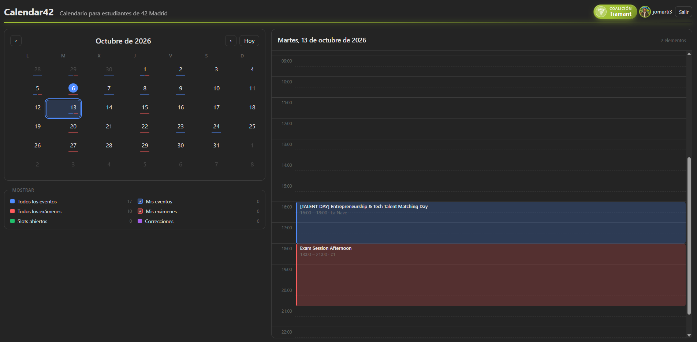

# Calendar42

**Calendar42 es una capa de planificación temporal sobre 42 Madrid.**

La información que un estudiante necesita para organizar su tiempo ya existe en la intra, pero está distribuida entre diferentes apartados. Calendar42 nace para reunirla en una única experiencia de calendario y facilitar una visión global de cómo encajan las distintas actividades de 42.

(Calendar42 live url)[https://calendar42.ideniox.com]



## El problema

Durante la experiencia en 42, la gestión del tiempo se convierte rápidamente en una parte importante de la organización del estudiante.

La idea de Calendar42 surgió a partir de la experiencia en la **Discovery de Python** y, posteriormente, en la **Piscina**, donde organizar los tiempos de estudio y de corrección resulta especialmente importante.

Hoy, para organizarse, el estudiante tiene que consultar información repartida por diferentes apartados de la intra, como:

- eventos;
- eventos en los que está inscrito;
- exámenes;
- slots de corrección;
- correcciones planificadas.

La intra ya ofrece información de calendario, pero el reto que identificamos es diferente: **tener una visión temporal unificada que permita entender cómo encajan todas esas actividades entre sí**.

Por ejemplo, un estudiante puede querer asistir a un evento y, al mismo tiempo, estar pensando en reservar una corrección o aprovechar un horario para estudiar. Cuanto más dispersa está la información, más difícil resulta tomar esa decisión de un vistazo.

El problema que Calendar42 intenta resolver es, por tanto, un problema de **gestión eficiente del tiempo dentro de 42**.

## La solución

**Calendar42 reúne la información temporal de 42 en una única interfaz de calendario.**

La propuesta se basa en una idea sencilla:

> **Una vista. Diferentes capas. Mejor planificación.**

El calendario permite trabajar visualmente con diferentes categorías de información para que el estudiante pueda entender su agenda sin tener que saltar constantemente entre diferentes apartados de la intra.

El objetivo no es sustituir la intra, sino crear una **capa de planificación temporal** sobre ella.

## Estado actual: primer prototipo funcional

Durante la hackathon hemos priorizado una primera versión funcional y deliberadamente contenida.

El prototipo actual demuestra la idea central de Calendar42 mediante:

- autenticación con la cuenta de 42 mediante OAuth;
- conexión con la API de 42;
- vista mensual;
- vista diaria organizada por horas;
- visualización de información temporal procedente de 42;
- cuatro modos bajo el calendario: **Eventos** (el de entrada), **Correcciones**, **Exámenes** y **Crear slots**;
- Correcciones: los proyectos del alumno aún sin terminar (solo los cerrados, pendientes de corrección, son seleccionables) y, para el elegido, los slots libres de otros estudiantes en el calendario y en las horas del día, desde donde se intenta reservar la corrección;
- Exámenes: los exámenes disponibles de hoy a dentro de un mes; Eventos: todos los eventos futuros del campus, con los inscritos marcados;
- eventos externos (tipo `extern` o `partnership` en la intra, o con un enlace de inscripción en la descripción) en un azul más claro que el de los eventos de 42 y con la etiqueta "Externo"; su ficha ofrece "Inscribirse en su web" con ese enlace, y en los de tipo externo "Apuntarme" sale desactivado, porque la intra no gestiona su inscripción;
- Crear slots: arrastrando sobre las horas del día se marca una franja y se crea el slot de corrección, en bloques de 15 minutos; un slot propio se puede borrar desde su ficha;
- lo que la API no permite se indica junto al botón correspondiente con su motivo, y los errores de la intra se muestran en rojo en el mismo sitio;
- ficha completa de cada elemento al pulsarlo, que ocupa el sitio de la vista del día (toda la pantalla en móvil) hasta cerrarla con su botón;
- descripción de eventos y exámenes renderizada como Markdown, igual que en la intra;
- aviso de slot libre u ocupado en la ficha, según el evento o examen se solape con lo que el estudiante ya tiene en su agenda;
- apuntarse y borrarse de un evento desde la propia ficha, cuando la intra lo permite;
- visualización de la coalición del usuario en la cabecera.

Esta versión debe entenderse como un **primer prototipo funcional**, todavía en una fase temprana de desarrollo.

Su objetivo en esta etapa no es cubrir todo el flujo de gestión de 42, sino demostrar que una capa temporal unificada puede convertirse en una forma más clara de organizar la actividad del estudiante.

## Próxima implementación: acciones sobre la información de 42

Durante el desarrollo hemos identificado y estudiado técnicamente varias acciones que ampliarían el prototipo actual.

Estas funcionalidades **no están implementadas todavía**, pero forman parte del siguiente paso natural del proyecto:

- inscribirse a un examen;
- agendar una corrección;
- visualizar slots abiertos de otros estudiantes y seleccionar uno para recibir una corrección.

Estas acciones requerirán implementar y validar las operaciones correspondientes sobre la API de 42.

La diferencia es importante: **el prototipo actual demuestra la capa de visualización y planificación, con una primera acción de gestión (apuntarse y borrarse de eventos); la siguiente iteración completaría esa capa de interacción.**

## Ideación y prototipado

La idea partió de una necesidad experimentada directamente durante la **Discovery de Python** y la **Piscina**: para organizar bien el estudio y las correcciones no basta con saber qué actividades existen, sino que es necesario saber **cómo encajan entre ellas en el tiempo**.

A partir de esta necesidad se planteó:

1. reunir la información temporal de 42 en una única interfaz;
2. organizarla mediante diferentes capas;
3. facilitar la detección visual de solapamientos;
4. evolucionar posteriormente desde la visualización hacia la interacción.

Durante la hackathon se decidió limitar el alcance de la primera versión para conseguir una base funcional y demostrable, dejando las operaciones de gestión como siguiente etapa de desarrollo.

## Equipo

### `svalero`

Conceptualización de la solución y definición del problema a partir de la experiencia como estudiante en 42.

- Propuesta inicial de Calendar42.
- Identificación del problema de gestión del tiempo.
- Definición de la idea y de las funcionalidades principales.
- Contribución a la definición funcional del producto.
- Preparación de la presentación y del pitch.

**Dedicación: 7 horas.**

### `jomarti3`

Desarrollo e implementación técnica del proyecto.

- Implementación del frontend.
- Implementación del backend.
- Integración con la API de 42.
- Implementación del sistema de autenticación.
- Integración y tratamiento de la información necesaria para construir la agenda.
- Puesta en funcionamiento del primer prototipo.

**Dedicación: 10 horas.**

## Organización del proyecto

El trabajo se dividió principalmente en dos bloques:

1. **Definición del problema y de la solución**, incluyendo la conceptualización de Calendar42 y la preparación de la presentación.
2. **Implementación técnica del prototipo**, incluyendo frontend, backend e integración con la API de 42.

Esta división permitió concentrar el tiempo disponible en conseguir una primera versión funcional y, posteriormente, preparar una evolución clara del producto.

## Integración con la API de 42

Calendar42 utiliza la API de 42 como fuente de información para construir la agenda del usuario.

| Recurso | Para qué | Token |
|---|---|---|
| `GET /v2/me` | Usuario y campus principal tras el login | usuario |
| `GET /v2/users/:id/coalitions` | Coaliciones a las que ha pertenecido el usuario (piscina, discovery, cursus...) | usuario |
| `GET /v2/blocs` | Coaliciones del cursus actual en el campus, para mostrar esa y no la de la piscina | usuario |
| `GET /v2/campus/:id/events` | Eventos del campus | usuario |
| `GET /v2/users/:id/events` | Eventos en los que el usuario está inscrito | usuario |
| `GET /v2/users/:id/events_users` | Inscripción del usuario a un evento (su id hace falta para borrarse) | usuario |
| `POST /v2/events_users` | Apuntarse a un evento | usuario |
| `DELETE /v2/events_users/:id` | Borrarse de un evento | usuario |
| `GET /v2/events/:id` | Releer un evento tras apuntarse o borrarse (número de inscritos) | usuario |
| `GET /v2/campus/:id/exams` | Exámenes del campus | app |
| `GET /v2/users/:id/exams` | Exámenes en los que el usuario está inscrito | app |
| `GET /v2/me/slots` | Slots de corrección del usuario | usuario |
| `GET /v2/me/scale_teams` | Correcciones planificadas | usuario |
| `GET /v2/projects/:id` | Nombre del proyecto de una corrección | usuario |
| `GET /v2/users/:id/projects_users` | Proyectos del usuario y su estado (cerrado, en curso, finalizado); los exámenes se descartan por su slug | usuario |
| `POST /v2/slots` | Abrir un slot de corrección propio (la intra lo trocea en bloques de 15 min) | usuario |
| `DELETE /v2/slots/:id` | Borrar un bloque de slot propio | usuario |
| `GET /v2/projects/:id/slots` | Slots libres de otros estudiantes para corregir un proyecto | usuario |
| `GET /v2/projects/:id/scales` | Escala de evaluación del proyecto, necesaria para reservar | usuario |
| `POST /v2/scale_teams` | Reservar una corrección (puede estar reservado al personal) | usuario |

### Decisiones y dificultades técnicas

- Los endpoints de exámenes devuelven `403` a los estudiantes, por lo que los exámenes se consultan utilizando el token de aplicación mediante `client_credentials`.
- La lista de inscritos de un examen (`/v2/exams/:id/exams_users`) está restringida a staff, por lo que para conocer los exámenes del usuario se utiliza `/v2/users/:id/exams`.
- `/v2/users/:id/coalitions` no indica a qué cursus pertenece cada coalición, por lo que un alumno que hizo la piscina recibe varias. La del cursus actual se identifica cruzándolas con los blocs del cursus (`/v2/blocs`).
- Los endpoints relacionados con slots y correcciones requieren el scope `projects`.
- Apuntarse y borrarse de eventos (`/v2/events_users`) requiere el scope `profile`; sin él la intra responde `403 Insufficient scope`. Si la app OAuth no lo tenía activado, hay que activarlo en la intra y volver a iniciar sesión para que el token lo incluya.
- La API no deja a un estudiante inscribirse ni borrarse de un examen (`/v2/exams_users`), así que en los exámenes el botón sale desactivado con ese motivo.
- Los slots propios se crean con `POST /v2/slots` y se borran bloque a bloque con `DELETE /v2/slots/:id` (scope `projects`). La intra valida la franja (futuro, bloques de 15 min); sus motivos se muestran junto al botón.
- Para reservar una corrección se consultan los slots libres del proyecto (`/v2/projects/:id/slots`) y se intenta crear el `scale_team` con la escala principal del proyecto y el corrector dueño del slot. Si la intra reserva esa acción al personal, el motivo aparece junto al botón.
- La API tiene un límite de 2 peticiones por segundo y 1200 por hora, compartidos por todos los usuarios de la aplicación. Las llamadas pasan por un limitador y se cuentan: cerca del límite horario, la caché deja de renovar y sirve lo que tiene.
- Para borrarse de un evento hace falta el id de la inscripción (`events_user`), no el del evento; se obtiene de `/v2/users/:id/events_users`. La intra valida aforo, fechas y plazo de cancelación: si rechaza la operación, la app muestra su motivo.
- La caché (`server/cache.js`) separa lo compartido de lo personal: los eventos y exámenes del campus se guardan por campus y rango durante 15 minutos, y los slots, correcciones e inscripciones por usuario durante 5 (los proyectos 10 y los slots libres de un proyecto 2). Pasado ese tiempo se sirve lo caducado al instante y se renueva en segundo plano, así nadie espera a la intra salvo la primera vez. Lo personal se invalida con cada acción del usuario (apuntarse, crear o borrar un slot, reservar). `GET /api/health` muestra las llamadas de la última hora y el estado de la caché.
- El token de autenticación permanece en el backend y no se expone al navegador.

## Puesta en marcha

Necesitas Node 22 y una aplicación OAuth registrada en:

https://profile.intra.42.fr/oauth/applications

La aplicación debe utilizar como redirect URI:

`http://localhost:5173/api/auth/callback`

y los scopes:

`public`, `projects` y `profile` (este último hace falta para apuntarse y borrarse de eventos).

```bash
nvm install 22
nvm use 22
npm install
cp .env.example .env
```

Rellena `FT_CLIENT_ID` y `FT_CLIENT_SECRET` en `.env` con el UID y SECRET de la aplicación OAuth.

Después:

```bash
npm run dev
```

La aplicación estará disponible en:

- Web: `http://localhost:5173`
- API: `http://localhost:3000`

El **modo demo con datos de ejemplo** está siempre disponible en la pantalla de login, también con credenciales: así se puede enseñar la aplicación aunque la intra esté caída o rechace las peticiones.

## Docker

Para ejecutarlo como un solo servicio, con la API sirviendo también el frontend compilado, hay un `Dockerfile`, un `docker-compose.yml` y un `Makefile` con el ciclo de vida:

```bash
make build     # construye la imagen
make start     # levanta el servicio en http://localhost:3000 (construye si hay cambios)
make logs      # sigue los logs
make stop      # para y elimina el contenedor
```

También `make restart`, `make status`, `make shell`, `make clean` (borra además la imagen y el volumen de sesiones) y `make doctor`, que muestra el puerto y la URL que se van a aplicar y quién ocupa ese puerto en el host: es lo primero que mirar si `make start` falla con "port is already allocated". Sin `make`, los mismos comandos son `docker compose build`, `docker compose up -d --build`, `docker compose logs -f` y `docker compose down`.

El contenedor lee las credenciales del mismo `.env`. Como todo va por el puerto 3000, el login de la intra vuelve a `http://localhost:3000/api/auth/callback`: registra también esa redirect URI en la app OAuth. Para publicarlo con otra URL, define `PUBLIC_URL` (y `PUBLIC_PORT` para el puerto del host) en `.env`. Las sesiones se guardan en el volumen `calendar42-data` y sobreviven a reinicios.

## API propia

| Ruta | Descripción |
|---|---|
| `GET /api/auth/login` | Redirige al login de la intra |
| `GET /api/auth/callback` | Vuelta del login y creación de la sesión |
| `GET /api/auth/me` | Usuario de la sesión |
| `POST /api/auth/logout` | Cierra la sesión |
| `GET /api/agenda?from&to` | Construye la agenda entre dos fechas ISO |
| `GET /api/events/upcoming` | Todos los eventos del campus desde hoy, con las inscripciones del usuario |
| `GET /api/projects` | Proyectos del usuario en su cursus, con su estado |
| `GET /api/projects/:id/slots?from&to` | Slots libres de otros estudiantes para corregir el proyecto |
| `POST /api/corrections` | Reserva una corrección del proyecto en un instante |
| `POST /api/slots` | Abre un slot de corrección propio entre dos instantes |
| `DELETE /api/slots` | Borra los bloques de un slot propio |
| `POST /api/events/:id/subscription` | Apunta al usuario al evento |
| `DELETE /api/events/:id/subscription` | Borra al usuario del evento |

## Estructura

```text
server/   Express: OAuth, sesiones y la API propia; en producción sirve
          también dist/. intra.js habla con la API de 42

Dockerfile, docker-compose.yml, Makefile
          Imagen y ciclo de vida en Docker (make start | stop | logs | build)

src/      React: Calendar, ModeBar (los cuatro modos), ProjectPicker, ItemList,
          SlotCreator, DayView (con arrastre para crear slots), ItemPopover,
          LoginView; carga de datos y acciones sobre la intra en App.jsx
```

## Evolución del producto

El primer objetivo de Calendar42 es resolver el problema de visualización y planificación temporal.

A partir de ahí, el proyecto puede evolucionar en varias direcciones.

### 1. Convertir la agenda en una herramienta de gestión

La inscripción a eventos ya está disponible. Las tres acciones restantes —inscripción a exámenes, agendado de correcciones y selección de slots abiertos— serían el siguiente paso para pasar de una agenda principalmente informativa a una herramienta de interacción con 42.

### 2. Integración con calendarios personales

Una posible evolución sería permitir que un evento de 42 pueda añadirse directamente al calendario personal del estudiante.

Calendar42 mantendría la responsabilidad sobre la información de 42, mientras que el calendario personal seguiría siendo responsable de la vida personal del estudiante.

Más adelante podría estudiarse una integración bidireccional, siempre mediante autorización explícita del usuario, para superponer compromisos personales y actividad de 42 y detectar conflictos o huecos disponibles.

**Esta línea todavía requiere estudio y validación técnica.**

### 3. Peer-to-peer incentivado

Otra posible evolución parte de los propios slots de corrección.

La propuesta sería:

> **ofrecer tiempo a la comunidad → ayudar a otro estudiante → recibir un beneficio.**

El tipo de beneficio dependería de las posibilidades y criterios de 42 Madrid. Podría plantearse mediante horas o días adicionales, Altaris, reconocimiento u otros incentivos.

**Esta línea todavía requiere estudio y validación técnica y no forma parte del prototipo actual.**

### 4. Presencialidad y comunidad

La misma lógica podría utilizarse para favorecer la asistencia a los clústers y la participación en actividades presenciales.

Calendar42 podría evolucionar desde una herramienta de planificación hacia una capa que también ayude a **organizar el tiempo, favorecer la colaboración y reforzar la comunidad presencial**.

**Esta línea todavía requiere estudio y validación técnica y no forma parte del prototipo actual.**

## Visión

Calendar42 empieza resolviendo un problema sencillo:

> **La información temporal de 42 está repartida.**

La primera respuesta es reunirla:

> **Una vista. Diferentes capas. Mejor planificación.**

El siguiente paso es convertir esa visión en una herramienta con la que el estudiante pueda no solo **ver** lo que ocurre en 42, sino también **organizar y gestionar** mejor su tiempo.

A largo plazo, la visión es construir una capa de planificación que conecte la actividad de 42 con las decisiones reales que toma el estudiante sobre su tiempo.

## Datos del equipo

| Participante | Login 42 | Responsabilidad | Horas |
|---|---|---|---:|
| Sergio | `svalero` | Conceptualización, definición funcional y presentación | 7 h |
| Jorge | `jomarti3` | Desarrollo e implementación técnica | 10 h |
| Maria Fernanda | `marbecer` | - |  0h |

**Repositorio:** `https://github.com/JorgeMartinezPizarro/calendar42`
